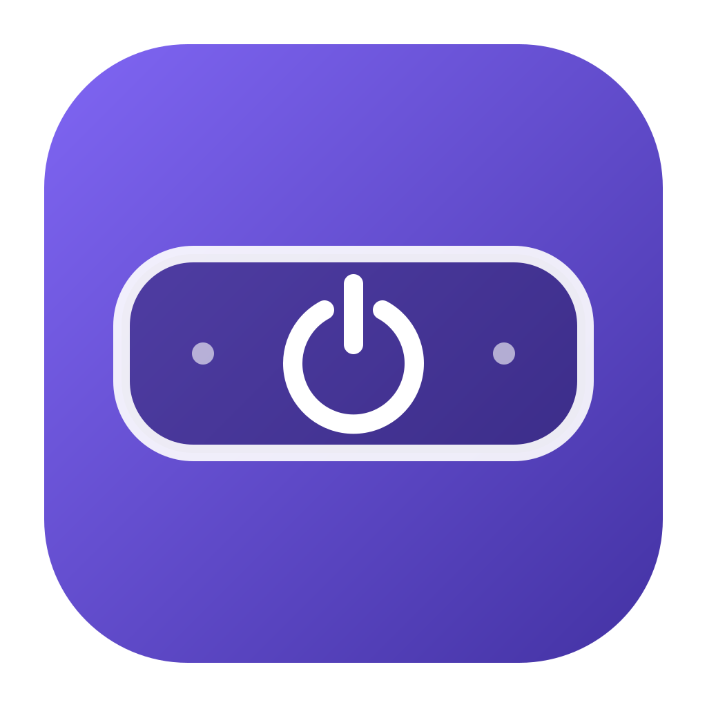

<p align="center"></p>

# Touch Bar Off

Маленькое бесплатное приложение для macOS: гасит и включает Touch Bar через переключатель в строке меню.

Создано, чтобы убрать раздражающее мерцание Touch Bar на MacBook Pro M1. В проверенном случае команда гашения остановила белые вспышки. Приложение не ремонтирует панель и не гарантирует такой же результат при любой неисправности.

**[Скачать приложение](https://github.com/stasdzzen/touchbar-off/releases/latest)** · **[Сообщить о проблеме](https://github.com/stasdzzen/touchbar-off/issues)**

## Возможности

В **1.2.1** фон кнопки рисуется явно, поскольку macOS может игнорировать системный `bezelColor`. Исправление проверено владельцем на MacBook Pro M1.

- Компактное системное меню macOS. Кнопка **Touch Bar**: красная — выбран режим гашения, зелёная — включения. Состояние также написано текстом.
- Ссылка **Dzzen.com** под кнопкой: `https://dzzen.com/?utm_source=touchbar-off&utm_medium=app&utm_campaign=menu`. Открывается в браузере только по нажатию.
- Кнопка **«Закрыть приложение»**. При выходе панель принудительно не включается.
- Сохранение выбора между запусками и повторение команды после сна.
- Монохромная иконка в строке меню, поддерживающая светлое и тёмное оформление macOS.

Нативный AppKit, без сторонних библиотек, фоновых сетевых запросов, встроенной аналитики, постоянного опроса и иконки в Dock. Не требует sudo, отключения SIP или прав универсального доступа. Автозапуск не добавляется.

## Совместимость

Проверено на **MacBook Pro 13″ M1 (`MacBookPro17,1`), macOS 26.6.2**. Готовый ZIP предназначен для **Apple Silicon** и собран с минимальной версией macOS 13. Это нижняя граница сборки, а не обещание проверки всех версий macOS. На M2, Intel и других версиях системы работа не проверена.

Приложение использует внутренний API Apple `DFRBrightness.framework`. После обновлений macOS он может измениться. На компьютерах без Touch Bar приложение бесполезно.

## Установка

1. В [релизах](https://github.com/stasdzzen/touchbar-off/releases/latest) скачайте `Touch-Bar-1.2.1-arm64.zip`.
2. Распакуйте архив и перенесите `Touch Bar.app` в папку «Программы».
3. Откройте приложение и нажмите иконку панели в верхней строке macOS.

При первом запуске выбирается **гашение**. Затем восстанавливается последний выбранный режим. Если нужно вернуть панель, включите переключатель.

Сборка имеет только локальную **ad-hoc подпись**, без Developer ID и нотариализации Apple. На другом Mac Gatekeeper может заблокировать скачанное приложение. ZIP — способ передачи, а не подтверждение доверия Apple. Альтернатива — самостоятельно собрать приложение из исходников ниже. Отключать системную защиту для сборки не требуется.

## Ограничения

- Переключатель показывает **выбранный режим**, а не измеренное аппаратное состояние панели.
- macOS может самостоятельно включить панель после системного события. После обычного сна программа повторяет выбранную команду; это поведение ещё не проверено реальным циклом сна.
- Не обещается отключение до входа в учётную запись, на экране блокировки или после закрытия приложения.
- Принятая команда гашения не доказывает физическое снятие питания с панели.

## Сборка из исходников

Нужны macOS и инструменты Apple Command Line Tools (`xcode-select --install`), либо установленный Xcode. Homebrew и сторонние зависимости не нужны.

```sh
git clone https://github.com/stasdzzen/touchbar-off.git
cd touchbar-off
./build-app.sh
open 'build/Touch Bar.app'
```

Скрипт собирает приложение под архитектуру текущего Mac. Публичный релиз собран на arm64; сборка и работа на Intel не проверены. Иконки генерируются локально средствами AppKit и `iconutil`.

Установить сборку в пользовательскую папку приложений:

```sh
mkdir -p "$HOME/Applications"
ditto 'build/Touch Bar.app' "$HOME/Applications/Touch Bar.app"
open "$HOME/Applications/Touch Bar.app"
```

Перед заменой уже установленного приложения закройте его через меню.

## Проверка и упаковка

```sh
./test.sh
./package.sh
```

В `dist/` появятся ZIP приложения и контрольная сумма SHA-256. ZIP можно передать другому человеку; исходники также доступны через **Code → Download ZIP** на GitHub.

Проверки используют подставной клиент панели и **не включают настоящий Touch Bar**. Проверяются команды on/off, сохранение выбора при отказе API и отсутствие команд до готовности клиента или без доступного дисплея. Отдельный тест проверяет реально отрисованные красные и зелёные пиксели фона в светлом и тёмном оформлении, без переключения настоящей панели. Также проверяются plist, shell-синтаксис, компиляция с предупреждениями как ошибками и подпись bundle.

Фактически проверены гашение панели на указанном M1 и открытие меню приложения. Владелец также подтвердил корректное отображение исправленного меню версии 1.2.1. Физическое включение через переключатель, выход кнопкой, повторение после сна и установка на другом Mac пока отдельно не проверены. Наличие тестов не заменяет эти проверки.

## Командная строка

При желании можно пользоваться только утилитой:

```sh
./build.sh
./touchbarctl off     # Погасить
./touchbarctl on      # Включить
./touchbarctl status  # Прочитать диагностическое состояние API
```

Числовые значения `state` недокументированы: не следует считать их надёжным доказательством включённого или выключенного дисплея. Для запуска двойным нажатием также сохранены файлы `Выключить Touch Bar.command` и `Включить Touch Bar.command`; перед использованием соберите `touchbarctl`.

## Исходники

| Файл | Назначение |
| --- | --- |
| `TouchBarApp.m` | Приложение в строке меню |
| `touchbarctl.m` | Консольная утилита |
| `assets/*.svg` | Векторные иконки |
| `render-icons.m` | Рисование PNG и набора размеров для ICNS средствами AppKit |
| `test-app.m` | Проверки логики без настоящей панели |
| `test-colors.m` | Проверки пикселей фона кнопки в светлом и тёмном оформлении |
| `build-app.sh`, `package.sh` | Сборка приложения и ZIP |

В приложении используются PNG 1×/2× для меню и ICNS для Finder. SVG служат редактируемыми векторными оригиналами; геометрия отрисовки также задана в `render-icons.m`.

## Удаление

Закройте приложение и удалите `Touch Bar.app`. Оно не устанавливает службы или автозапуск. Единственная сохраняемая настройка — выбранный режим в домене `local.touchbaroff.menubar`. При необходимости её можно удалить отдельно:

```sh
defaults delete local.touchbaroff.menubar
```

## Лицензия

**© 2026 Dzzen.com.** Код и иконки распространяются по [лицензии MIT](LICENSE).
